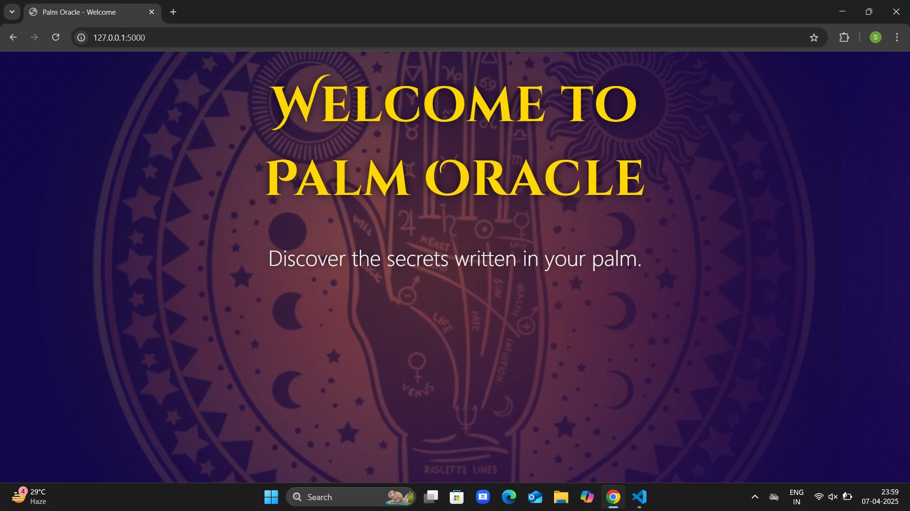
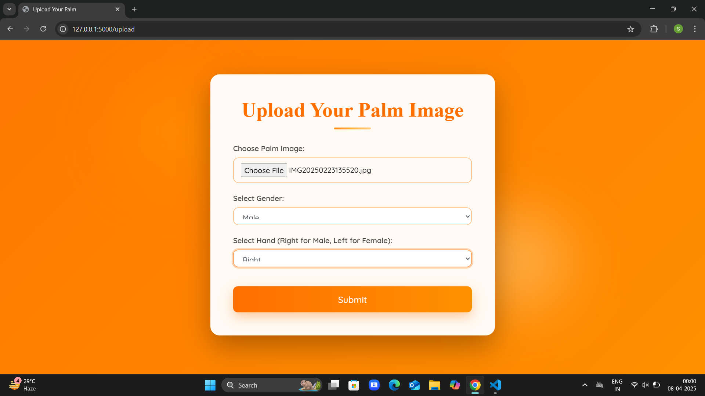
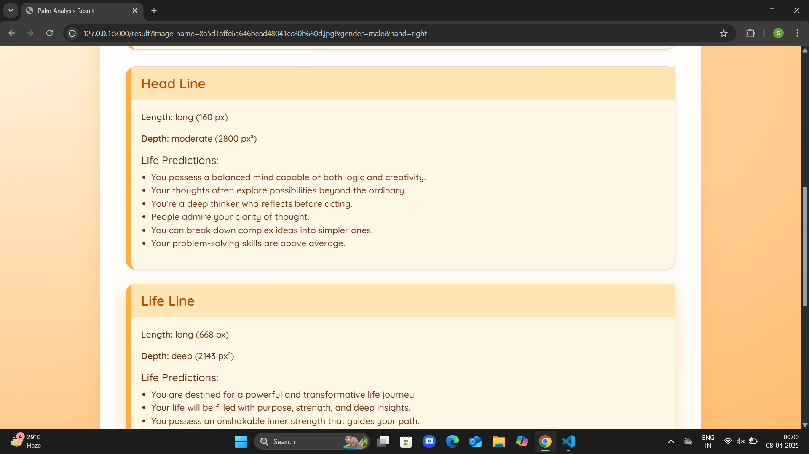
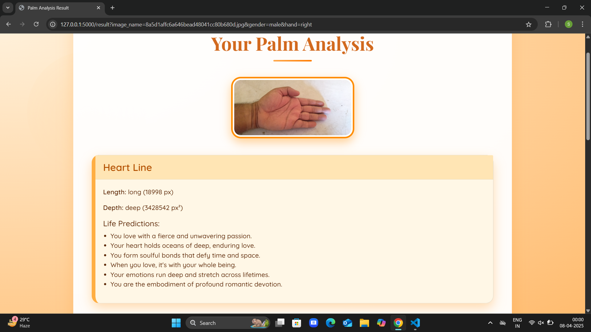
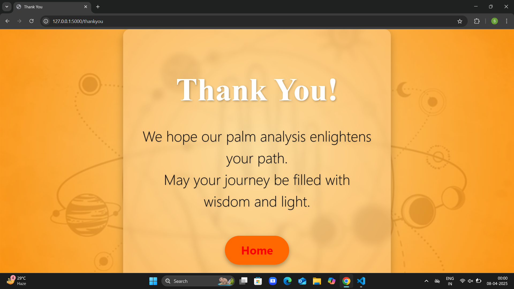

# 🔮 Palm Oracle – ML-Based Palm Reading App

**Palm Oracle** is a smart web application that blends traditional palmistry with modern technology. Using machine learning and image processing, it detects major palm lines from an uploaded palm image and provides predictions based on their length and depth — just like a digital palm reader!

---

 🌟 Key Features

- 🖐️ Automatically detects Heart, Head, Life, and Fate lines from palm images
- 🤖 Uses trained ML models to classify line length (short, medium, long) and depth (shallow, medium, deep)
- 🔮 Generates palmistry-based personality insights
- 🌐 Built with Flask and styled with HTML, CSS, and Bootstrap
- 🖼️ Provides a visual analysis by marking lines on uploaded images

---

 📸 Screenshots
 🖼️ Welcome Page


 📤 Upload Page


 📊 Palm Result – Part 1


 📊 Palm Result – Part 2


 ✅ Thank You Page


 🚀 Getting Started

 1. Clone this repository
```bash
git clone https://github.com/shwe-19/Palm-Oracle.git
cd Palm-Oracle
